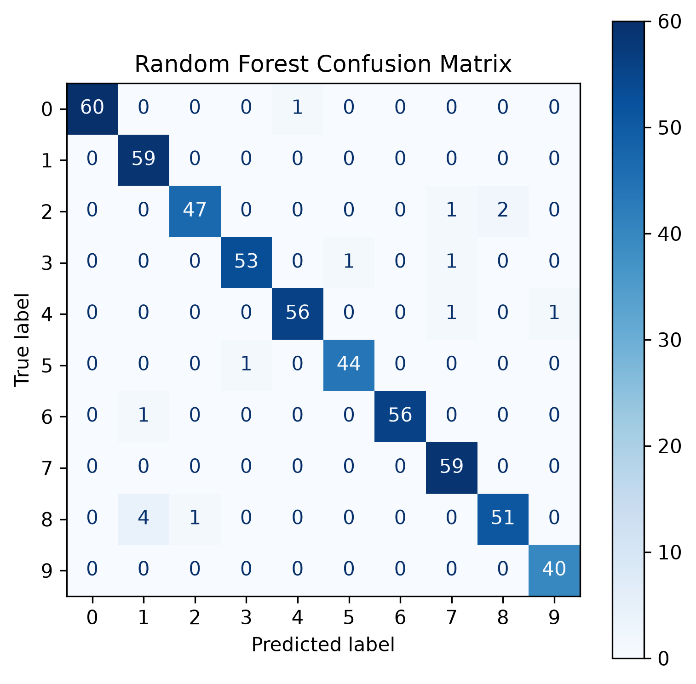
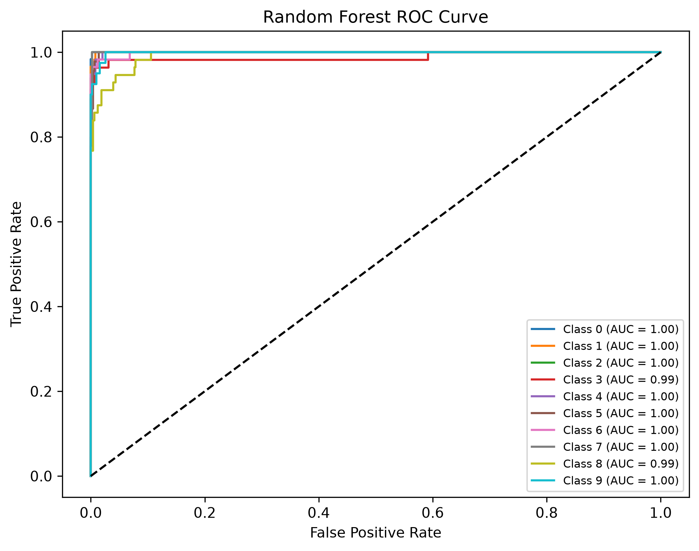

````markdown
# 🔢 Handwritten Digit Recognition using Machine Learning

A machine learning project that classifies handwritten digits (0–9) using the **Scikit-learn Digits Dataset**. The project compares multiple classification algorithms, applies dimensionality reduction using PCA, and evaluates model performance with several metrics and visualizations.

---

## ✨ Features

- Handwritten digit classification
- Digits Dataset from Scikit-learn
- Data preprocessing and normalization
- Principal Component Analysis (PCA)
- Multiple machine learning models
- Performance comparison
- Hyperparameter optimization using GridSearchCV
- Confusion Matrix visualization
- ROC Curve visualization
- Automatic plot generation

---

## 📊 Dataset

**Source**

```python
from sklearn.datasets import load_digits
```

Dataset Information:

- **Samples:** 1,797
- **Classes:** 10 (Digits 0–9)
- **Original Features:** 64 (8×8 grayscale images)
- **Reduced Features:** 32 (using PCA)

---

## 🤖 Machine Learning Models

The project compares the following classifiers:

- Random Forest *(Optimized using GridSearchCV)*
- Support Vector Machine (SVM)
- Artificial Neural Network (MLPClassifier)
- K-Nearest Neighbors (KNN)

---

## ⚙️ Data Preprocessing

- Train/Test Split
- MinMax Feature Scaling
- Principal Component Analysis (PCA)

---

## 📈 Evaluation Metrics

The models are evaluated using:

- Accuracy
- Precision
- Recall
- Confusion Matrix
- ROC Curve

---

## 🔍 Hyperparameter Optimization

The Random Forest classifier is optimized using **GridSearchCV** with 5-fold cross-validation.

Optimized parameters include:

- `n_estimators`
- `max_depth`

---

# 📷 Results

## 🌲 Random Forest Confusion Matrix

<p align="center">
    
</p>

---

## 🌲 Random Forest ROC Curve

<p align="center">
    
</p>

---

> **Note:** Confusion Matrix and ROC Curve images for all implemented models are available inside the **images/** directory.

---

## 📁 Project Structure

```text
.
├── digit_recognition.ipynb
├── README.md
├── requirements.txt
├── .gitignore
└── images/
    ├── random_forest_confusion_matrix.png
    ├── random_forest_roc_curve.png
    ├── svm_confusion_matrix.png
    ├── svm_roc_curve.png
    ├── knn_confusion_matrix.png
    ├── knn_roc_curve.png
    ├── neural_network_confusion_matrix.png
    └── neural_network_roc_curve.png
```

---

## 🚀 Installation

Clone the repository

```bash
git clone https://github.com/your-username/your-repository.git
```

Enter the project directory

```bash
cd your-repository
```

Install dependencies

```bash
pip install -r requirements.txt
```

Launch Jupyter Notebook

```bash
jupyter notebook
```

Open the notebook and run all cells.

---

## 🛠 Technologies Used

- Python
- NumPy
- Pandas
- Matplotlib
- Scikit-learn
- Jupyter Notebook

---

## 🚀 Future Improvements

- Hyperparameter tuning for SVM and KNN
- Classification Report visualization
- Precision–Recall Curve
- Model serialization using Joblib
- Web deployment using Flask or Django

---

## 📄 License

This project is licensed under the **MIT License**.
````

